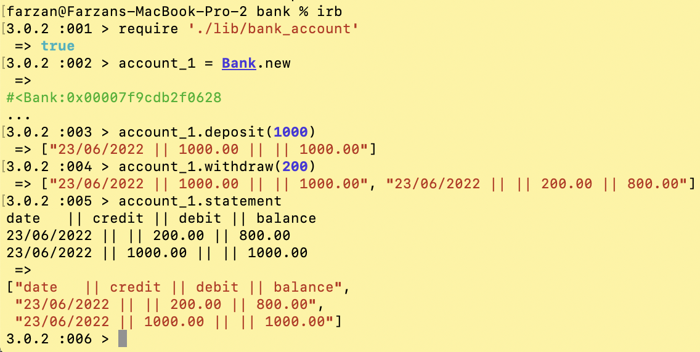
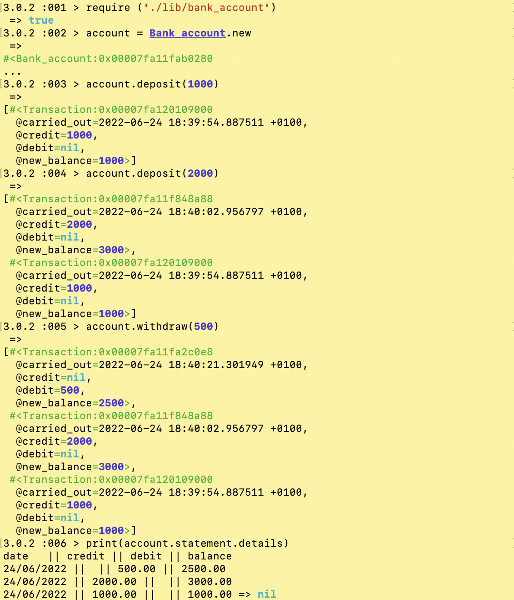

# Bank Tech Test

```
─────────────█████████████──────────────
──────────────███████████───────────────
───────────────██████████───────────────
────────────────████████────────────────
────────────────▐██████─────────────────
────────────────▐██████─────────────────
──────────────── ▌─────▌────────────────
────────────────█████████───────────────
────────────████████████████────────────
──────────███████████  ███████──────────
────────████████████     ███████────────
──────███████████          ██████───────
─────████████████   ██  ██████████──────
────████████████            ████████────
───██████████████       █   █████████───
──████████████████████  ██   █████████──
──█████████████████████  ██   █████████─
─██████████████████████  ██   ██████████
███████████████████████       ██████████
███████████████████          ███████████
─███████████████████████  ██████████████
─███████████████████████  █████████████─
──█████████████████████████████████████─
───██████████████████████████████████───
───────██████████████████████████████───
───────██████████████████████████───────
─────────────███████████████────────────
```

## Introduction
Given a tech test which aimed to replicate an actual job interview tech test. This gave an opportunity to showcase OO design and TDD skills. Time limit of 48 hours to implement the below acceptance criteria. 

## Specification

### Requirements

* Be able to interact with written code via a REPL like IRB or Node.  (Don't need to implement a command line interface that takes input from STDIN.)
* Deposits, withdrawals
* Account statement (date, amount, balance) printing
* Data can be kept in memory (it doesn't need to be stored to a database or anything)

### Acceptance criteria

**Given** a client makes a deposit of 1000 on 10-01-2023  
**And** a deposit of 2000 on 13-01-2023  
**And** a withdrawal of 500 on 14-01-2023  
**When** she prints her bank statement  
**Then** she would see

```
date || credit || debit || balance
14/01/2023 || || 500.00 || 2500.00
13/01/2023 || 2000.00 || || 3000.00
10/01/2023 || 1000.00 || || 1000.00
```

## Installation and use
1. Fork this repo
2. Navigate to desired file path in command line
3. Clone to your local machine using `git clone <your repo name>`
4. Install Rspec using `rspec --init`
5. Run the tests for the program using `rspec` in the command line
6. See below to use the app on an interactive shell

## Self-assessment

### Ruby IRB command line interface snippet 

#### How to run this program
1. Follow the installation steps above
2. Navigate to bank account directory
3. Type into command line/REPL `irb` to be able to run **interactive ruby**
4. Type `require './lib/bank_account'` to use the ruby file
5. Set up a new bank account and call it anything i.e. `my_first_account = Bank.new` - your account name is set to `= Bank.new` to make a new instance of the account
6. Can use deposit and withdrawal functionality using either `.deposit` or `.withdraw` on the chosen account - use `.deposit` to put money in first though!
7. Use `print(my_first_account.statement.details)` substituting the account name for your account to get the transactions placed

#### Previous functionality before splitting the class into three classes


#### After splitting into three classes


## My approach
* Started off by planning what I expected my bank class to look like and took into account the functionality of it
* Went by the acceptance criteria and made a deposit, withdrawal and statement feature
* I had issues with the date formatting as well as the string interpolation for the amounts being 2 decimal places
* This was rectified with the use of `+` string interpolation (that Rubocop did not like) which meant I could have the amounts in 2 decimal places (like how it appears in an actual bank statement)
* The above was changed afterwards when I came across the format method which allowed to incorporate the decimal points into the transaction class and use this instead to get the required result
* With the dates, they were previously required to be inputted manually, then it could have been left blank and the default date will be the date of when the transaction took place (in day/month/year format) where as now using the `carried_out` within the attr_reader and assigning the `Time.now` in the transaction class and then in the statement class give it formatting using `strftime` method

## Edge case
* As this is done in Ruby, there was an implicit return from the method and therefore the statement output was given twice - this is now fixed after the splitting of the class and only gives the `nil` word after the statement has been displayed (as shown at the bottom of the second code screenshot)

## Future integration
* Cannot withdraw an amount that is greater than their balance - before I split my class this was working but afterwards I could not get it to work and left my test and code commented out for future integration (as this bank doesn't offer overdrafts)

### Criteria form
Once completed the challenge and happy with the solution, here's the form to help reflect on the quality of the code: [form](https://docs.google.com/forms/d/1Q-NnqVObbGLDHxlvbUfeAC7yBCf3eCjTmz6GOqC9Aeo/edit)
